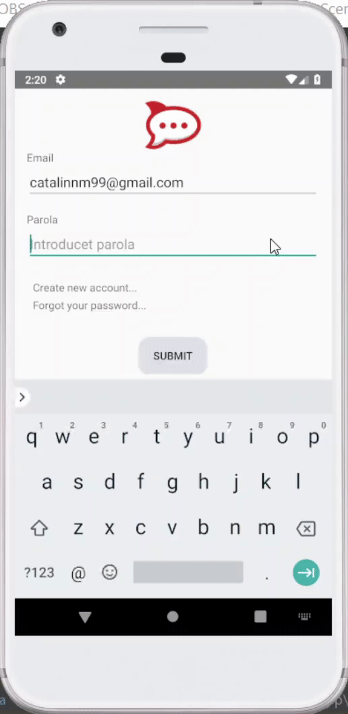

# Chat

## About

This is a project I was developing while learning Android apps development curve. It's in a very incipient form, but usable.

It needs more time to be finished but I feel like I reached my goal, so it's not a priority for me anymore. I will finish this when I will find some free time between university homework.

## Description

This application allows you to chat with your friends like an usual Android app. It's designed to be very simple, providing only essential features like:

- Create an account
- Add other contacts
- Create groups of contacts
- Give nicknames for users in a group
